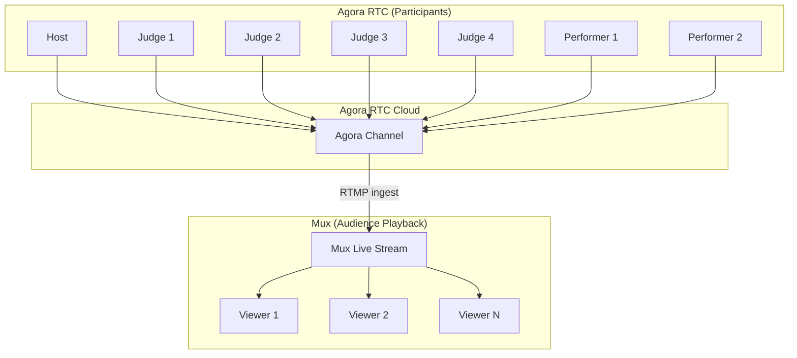

# Video Streaming Architecture Plan

## Current State
- **Agora SDK**: Already installed (`agora-rtc-sdk-ng@^4.24.2`)
- **Mux SDK**: Already installed (`@mux/mux-player-react@^3.11.5`)
- **Environment Variables**: Already configured in `.env.example`
  - `VITE_AGORA_APP_ID=96360db28886429a891d823347bdfa43`
  - `VITE_AGORA_APP_CERTIFICATE=0b461279d7a64a12b8f2b47575114c47`
  - `VITE_MUX_TOKEN_ID=2f1ee120-69d2-4876-b483-882fa6468f6c`

## Architecture Overview

### Video Stream Flow


### Important: Audience watches via Mux, NOT RTC
- **Host, Judges, Performers**: Use Agora RTC for real-time interaction
- **Audience/Viewers**: Watch via Mux player (no RTC connection)

### Agora to Mux Flow
1. Host/Judges/Performers join Agora RTC channel
2. Agora Cloud Recording or RTMP Streaming pushes to Mux
3. Mux provides playback URL for audience
4. Viewers watch via Mux player (not RTC)

### Channel Structure
- **Channel Name**: `show-{showId}` (e.g., `show-123`)
- **User Roles** (in Agora RTC):
  - `host` - Can publish video/audio, controls show
  - `judge` - Can publish video/audio, votes
  - `performer` - Can publish video/audio, performs
- **Audience**: Does NOT join Agora - watches via Mux only

### Implementation Plan

#### 1. Create Agora Service Hook (`src/hooks/useAgora.ts`)

**Responsibilities**:
- Initialize Agora client
- Join/leave channels
- Manage local video/audio tracks
- Handle remote user streams
- Generate tokens

**Key Functions**:
```typescript
// Main hook API
useAgora(channelName: string, role: 'host' | 'judge' | 'performer' | 'viewer')
```

**Returns**:
- `localVideoTrack` - Local camera track
- `localAudioTrack` - Local microphone track
- `remoteUsers` - Map of remote user tracks
- `join` - Function to join channel
- `leave` - Function to leave channel
- `muteAudio` / `unmuteAudio`
- `muteVideo` / `unmuteVideo`
- `isJoined` - Connection status

#### 2. Create Token Generation Service

**Backend** (Supabase Edge Function):
- Endpoint: `/agora-token`
- Generates RTC tokens using Agora App Certificate
- Validates user permissions

**Token Parameters**:
- `channelName`: `show-{showId}`
- `uid`: User ID
- `role`: Publisher or Subscriber
- `expireTime`: Token expiry (24 hours)

#### 3. Create Mux Integration (`src/hooks/useMuxStream.ts`)

**Responsibilities**:
- Fetch Mux playback URL
- Handle stream status (live/offline)
- Fallback to YouTube if Mux unavailable

**Returns**:
- `playbackUrl` - Mux playback URL
- `isLive` - Stream status
- `error` - Any playback errors

#### 4. Update LiveShowPage Components

**Performer Cards** (left and right):
- Replace static avatar with `<AgoraVideo>` component
- Show local video for performer
- Show remote video for other participants

**Host Card**:
- Show host's video stream
- When speaking, larger video

**Judge Cards**:
- Show each judge's video stream
- LIVE status indicator

**Viewer Area**:
- Use Mux player for live playback
- Fallback to YouTube embed

#### 5. Video Control Panel

**For Host/Judges/Performers**:
- Camera toggle (on/off)
- Microphone toggle (mute/unmute)
- Screen share button
- Leave stage button

#### 6. State Management

**In `useAppStore`**:
```typescript
// Video state
videoEnabled: boolean
audioEnabled: boolean
isScreenSharing: boolean
localStream: MediaStream | null

// Agora state  
agoraChannel: string | null
agoraToken: string | null

// Mux state
muxPlaybackId: string | null
muxStreamUrl: string | null
```

## Component Structure

```
src/
├── hooks/
│   ├── useAgora.ts          # Main Agora hook
│   └── useMuxStream.ts      # Mux playback hook
├── components/
│   ├── AgoraVideo.tsx       # Video player component
│   ├── MuxPlayer.tsx        # Mux player wrapper
│   ├── VideoControls.tsx    # Camera/mic controls
│   └── LocalVideo.tsx       # Local video preview
└── pages/
    └── LiveShowPage.tsx     # Updated with video
```

## Database Schema Updates

**Shows table** (add if not exists):
```sql
-- Add Agora and Mux fields to shows table
ALTER TABLE shows 
ADD COLUMN IF NOT EXISTS agora_channel_name TEXT,
ADD COLUMN IF NOT EXISTS mux_stream_id TEXT,
ADD COLUMN IF NOT EXISTS mux_playback_id TEXT;
```

## Implementation Steps

1. **Create Agora hook** (`useAgora.ts`)
   - Initialize Agora client
   - Join/leave channel logic
   - Track management

2. **Create token generation** (Supabase Edge Function)
   - `/agora-token` endpoint
   - Token generation with App Certificate

3. **Create Mux hook** (`useMuxStream.ts`)
   - Fetch playback URL
   - Stream status monitoring

4. **Create video components**
   - `AgoraVideo` - Renders video track
   - `VideoControls` - Control panel

5. **Integrate into LiveShowPage**
   - Replace placeholder avatars with video
   - Add controls for host/judges/performers

6. **Add viewer fallback**
   - Mux player for live stream
   - YouTube embed fallback
